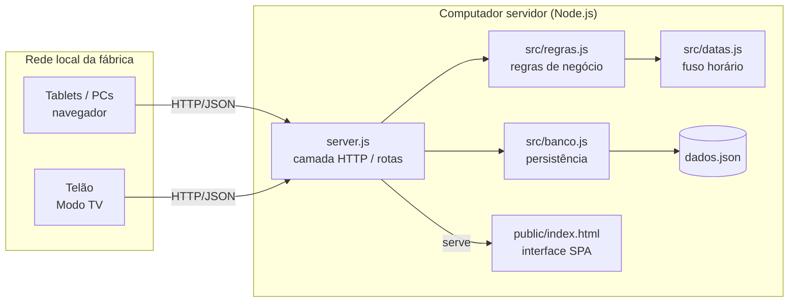
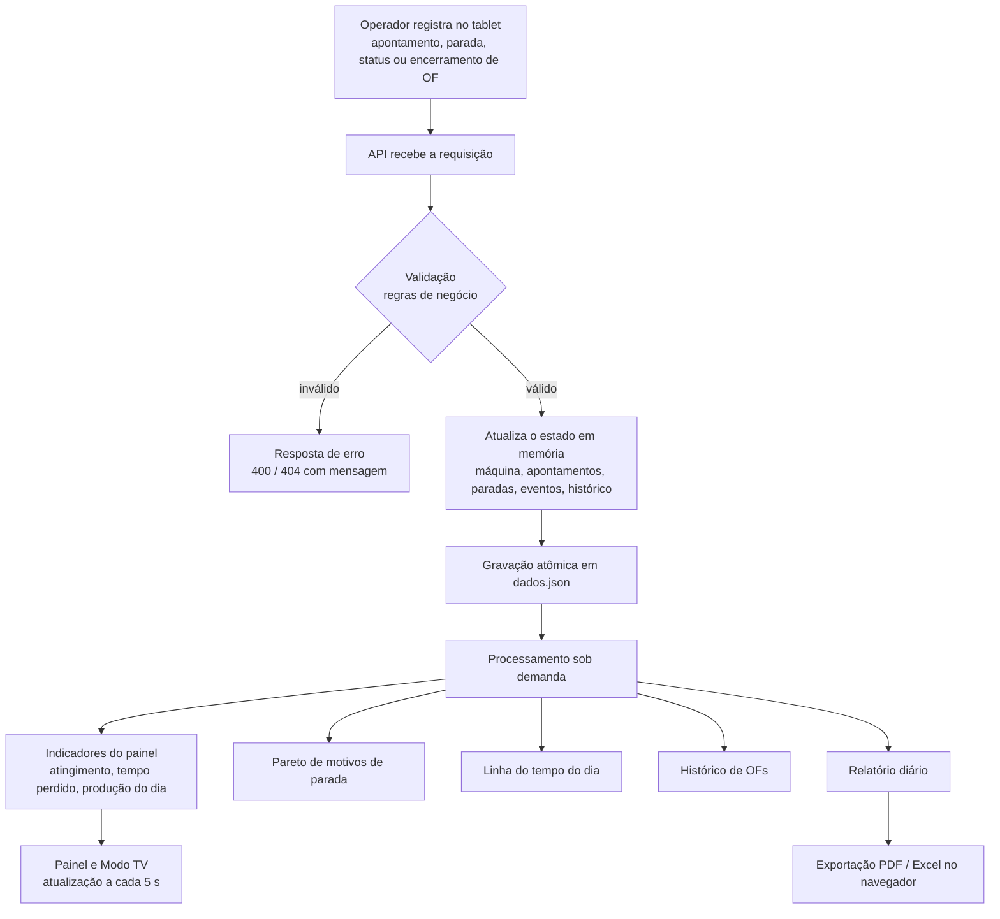
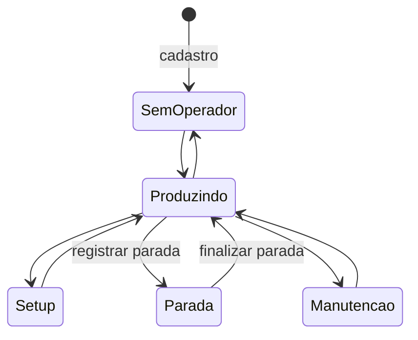
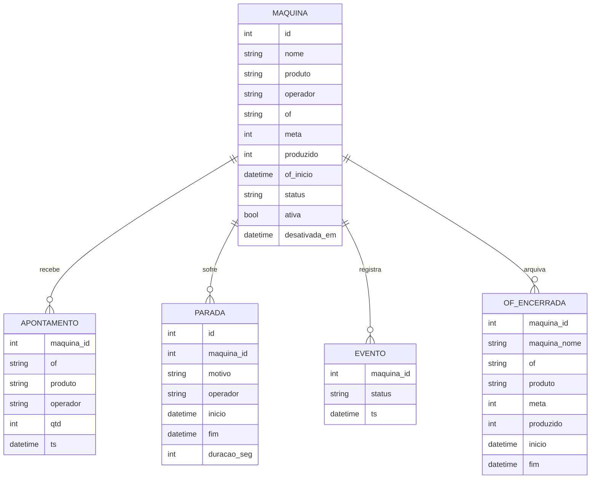

# FactoryPulse — Documentação Técnica

Versão 2.1.0

## 1. Visão geral

O FactoryPulse é um sistema de monitoramento de produção (MES simplificado) para uso em rede local de fábrica. Um computador atua como servidor; tablets e PCs acessam a interface pelo navegador. O sistema recebe registros do chão de fábrica (produção por turno, paradas, mudanças de status e encerramento de ordens de fabricação), aplica regras de negócio e produz indicadores e relatórios para a gestão da produção.

**Escopo:** acompanhamento de máquinas, ordens de fabricação (OF), paradas e produção apontada manualmente.
**Fora do escopo:** integração automática com CLPs/sensores, controle de qualidade (refugo), planejamento de produção, acesso externo à rede da fábrica.

## 2. Atores

| Ator | Descrição |
|---|---|
| Operador | Aponta a produção do turno, registra e finaliza paradas, altera o status da máquina. |
| Supervisor / PCP | Encerra e abre OFs, cadastra e desativa máquinas, consulta histórico e relatórios. |
| Telão (Modo TV) | Tela de acompanhamento com atualização automática a cada 5 segundos. |

Nesta versão não há autenticação: todos os usuários da rede local têm o mesmo acesso (ver seção 10).

## 3. Requisitos funcionais

| ID | Requisito |
|---|---|
| RF01 | Cadastrar máquina com nome (obrigatório e único entre as ativas), produto, operador, OF inicial e meta. |
| RF02 | Editar dados cadastrais da máquina (nome, produto, operador, OF e meta). |
| RF03 | Desativar máquina, preservando todo o seu histórico (exclusão lógica). |
| RF04 | Apontar a quantidade produzida no turno, somando-a ao total da OF atual. |
| RF05 | Encerrar a OF atual, arquivando-a no histórico, e abrir nova OF com produto e meta. |
| RF06 | Alterar o status da máquina (Produzindo, Setup, Parada, Manutenção, Sem operador). |
| RF07 | Registrar parada com motivo e operador, cronometrando até sua finalização. |
| RF08 | Finalizar parada, calculando a duração e retornando a máquina ao status Produzindo. |
| RF09 | Exibir painel com indicadores gerais e cartão por máquina. |
| RF10 | Exibir a linha do tempo de eventos do dia por máquina. |
| RF11 | Exibir o Pareto de motivos de parada, com percentual individual e acumulado. |
| RF12 | Exibir o histórico de OFs encerradas com atingimento da meta. |
| RF13 | Gerar relatório de um dia escolhido: produção apontada por máquina, paradas e Pareto do dia. |
| RF14 | Exportar o relatório diário em PDF e Excel. |
| RF15 | Exibir Modo TV com atualização automática. |

## 4. Requisitos não funcionais

| ID | Requisito |
|---|---|
| RNF01 | Executar em Node.js 18+ sem dependências externas no servidor. |
| RNF02 | Funcionar na rede local sem internet (exceto a exportação PDF/Excel, que carrega bibliotecas via CDN). |
| RNF03 | Persistir os dados em arquivo local com gravação atômica, evitando corrupção em caso de queda de energia. |
| RNF04 | Calcular datas no fuso horário da fábrica (padrão `America/Sao_Paulo`), configurável por `FP_TZ`. |
| RNF05 | Interface em português, utilizável em tablets e PCs. |
| RNF06 | Validar todas as entradas no servidor e devolver mensagens de erro claras (HTTP 400/404/413). |
| RNF07 | Sanitizar textos digitados, removendo os caracteres `<` e `>`. |
| RNF08 | Limitar o corpo das requisições a 100 KB. |
| RNF09 | Bloquear acesso a arquivos fora da pasta pública. |
| RNF10 | Possuir testes automatizados das regras de negócio e da API. |

## 5. Regras de negócio

| ID | Regra |
|---|---|
| RN01 | **Atingimento da meta (%)** = produzido ÷ meta da OF × 100, arredondado e limitado a 100%. Meta zero resulta em 0%. |
| RN02 | O total produzido de uma OF só é alterado por apontamento (RF04). Edição direta é rejeitada. |
| RN03 | Quantidade apontada deve ser número inteiro maior que zero. Meta deve ser inteiro maior ou igual a zero. |
| RN04 | Cada máquina pode ter no máximo uma parada em aberto. |
| RN05 | Com parada em aberto, a máquina não pode mudar para outro status além de Parada; é necessário finalizar a parada. |
| RN06 | Duração da parada = fim − início, em segundos; exibida em minutos arredondados. |
| RN07 | O "dia" de cada registro é determinado pela data local no fuso da fábrica, e não em UTC. |
| RN08 | O relatório diário considera apenas apontamentos e paradas finalizadas cuja data local é o dia pedido. |
| RN09 | Máquina desativada sai do painel, mas continua no relatório dos dias em que teve movimento, identificada como "(desativada)". |
| RN10 | Não é possível desativar máquina com parada em aberto. |
| RN11 | Ao encerrar uma OF, ela é arquivada com meta, produzido, início e fim; a produção da máquina é zerada para a nova OF. |
| RN12 | Pareto: motivos ordenados do maior para o menor tempo total, com percentual individual e acumulado. |

**Sobre o indicador:** o sistema calcula *atingimento da meta*, e não OEE. O OEE (Overall Equipment Effectiveness) é o produto de Disponibilidade × Performance × Qualidade e exige tempo planejado de produção, tempo de ciclo ideal e quantidade de refugo, dados que esta versão não coleta (ver seção 11).

## 6. Arquitetura

Arquitetura cliente-servidor em rede local, com o servidor organizado em camadas.

| Camada | Responsabilidade |
|---|---|
| `server.js` | Recebe requisições, roteia para a regra correspondente, grava o banco após operações de escrita, converte erros em respostas HTTP. |
| `src/regras.js` | Regras de negócio e cálculos. Funções puras sobre o objeto do banco, sem acesso a disco ou rede, o que permite testá-las isoladamente. |
| `src/banco.js` | Carga, normalização (compatibilidade com versões anteriores) e gravação atômica do arquivo JSON. |
| `src/datas.js` | Conversão de instantes para dia e hora locais no fuso configurado. |
| `public/index.html` | Interface de página única que consome a API e gera PDF/Excel no navegador. |

## 7. Fluxo de dados (pipeline)

### Ciclo de status da máquina

## 8. Modelo de dados

Os dados ficam em um único arquivo JSON (`dados.json`), com as coleções abaixo.

Datas são gravadas em ISO 8601 (UTC) e convertidas para o fuso local apenas na consulta.

## 9. API REST

Todas as respostas são JSON. Erros retornam `{ "erro": "mensagem" }` com o código HTTP correspondente.

| Método | Rota | Descrição | Corpo |
|---|---|---|---|
| GET | `/api/maquinas` | Lista máquinas ativas com indicadores | — |
| POST | `/api/maquinas` | Cadastra máquina | `nome`, `produto`, `operador`, `of`, `meta` |
| PUT | `/api/maquinas/:id` | Edita dados cadastrais | `nome`, `produto`, `operador`, `of`, `meta` |
| DELETE | `/api/maquinas/:id` | Desativa máquina (exclusão lógica) | — |
| POST | `/api/maquinas/:id/apontar` | Aponta produção do turno | `qtd`, `operador` |
| POST | `/api/maquinas/:id/encerrar-of` | Encerra OF e abre nova | `novaOf`, `novoProduto`, `novaMeta` |
| POST | `/api/maquinas/:id/status` | Altera status | `status` |
| POST | `/api/maquinas/:id/parar` | Registra parada | `motivo`, `operador` |
| POST | `/api/maquinas/:id/retomar` | Finaliza parada em aberto | — |
| GET | `/api/maquinas/:id/timeline` | Eventos do dia | — |
| GET | `/api/resumo` | Indicadores gerais do painel | — |
| GET | `/api/pareto` | Pareto geral de motivos de parada | — |
| GET | `/api/historico-of` | OFs encerradas | — |
| GET | `/api/relatorio?dia=AAAA-MM-DD` | Relatório do dia (padrão: hoje) | — |

## 10. Segurança e privacidade

- **Acesso:** restrito à rede local; o servidor não é exposto à internet. Não há autenticação nesta versão; qualquer dispositivo da rede pode operar o sistema.
- **Entradas:** validadas no servidor; textos sanitizados; corpo limitado a 100 KB; JSON malformado rejeitado.
- **Arquivos:** o servidor só entrega arquivos da pasta `public/`.
- **Dados pessoais (LGPD):** o sistema pode registrar o nome do operador associado a apontamentos e paradas, o que constitui dado pessoal e pode ser utilizado para avaliação de desempenho. Recomenda-se informar os operadores sobre a finalidade do registro (art. 6º, I e VI, e art. 9º da Lei 13.709/2018), definir prazo de retenção, restringir o acesso aos relatórios e, quando possível, operar sem nomes (o campo é opcional). O arquivo de dados não é versionado no repositório.

## 11. Limitações conhecidas e evolução

| Limitação | Evolução proposta |
|---|---|
| Sem autenticação e perfis de acesso | Login com perfis Operador e Supervisor; registro de quem executou cada ação. |
| Indicador de atingimento, não OEE | Cadastrar tempo planejado por turno, tempo de ciclo ideal e refugo, para calcular Disponibilidade × Performance × Qualidade. |
| Persistência em arquivo JSON, adequada a uma instância e volume moderado | Migrar para SQLite ou PostgreSQL. |
| Exportação PDF/Excel depende de internet (CDN) | Servir as bibliotecas localmente pela pasta `public/`. |
| Apontamento manual | Integração com contadores/CLP das máquinas. |
| Sem política automática de retenção de dados | Rotina de expurgo/anonimização após prazo definido. |

## 12. Testes

Executados com `npm test` (executor nativo `node:test`, sem dependências).

**Testes unitários (`test/regras.test.js`):** cálculo de atingimento; conversão de fuso (registro às 22h30 de Brasília permanece no mesmo dia); ordenação e percentual acumulado do Pareto; soma e validação de apontamentos; bloqueio de edição direta do produzido; encerramento de OF; regras de parada em aberto; rejeição de status inválido; desativação com preservação de histórico; relatório diário restrito aos registros do dia; sanitização de textos; unicidade de nome.

**Testes de integração (`test/api.test.js`):** sobem o servidor real em porta livre, com arquivo de dados temporário, e verificam o fluxo completo (cadastro → apontamento → parada → relatório → desativação), a persistência em arquivo, os códigos de erro da API e o bloqueio de acesso a arquivos fora da pasta pública.

Resultado da versão 2.1.0: 16 testes, 16 aprovados.

## 13. Histórico de versões

| Versão | Alterações |
|---|---|
| 2.0.0 | Versão inicial: painel, apontamento, paradas, OFs, Pareto, relatórios, Modo TV. |
| 2.1.0 | Separação em camadas (HTTP, regras, persistência, datas); cálculo de datas no fuso local; relatório diário baseado nos registros do dia; indicador renomeado de "OEE" para "Atingimento da meta"; exclusão de máquina substituída por desativação com preservação de histórico; bloqueio de edição direta do produzido; validação e sanitização de entradas; gravação atômica; testes automatizados; gerador de dados de demonstração; documentação técnica. |
